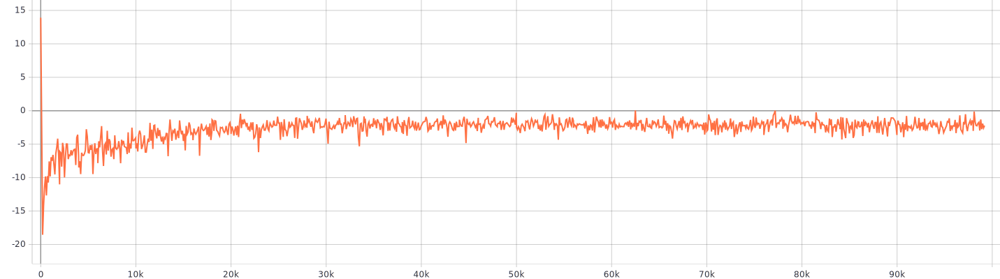
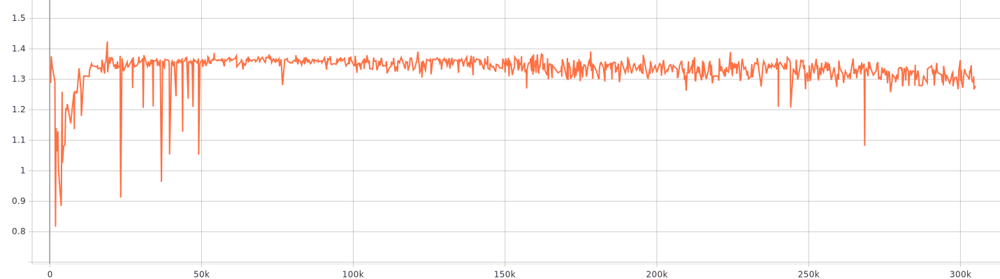
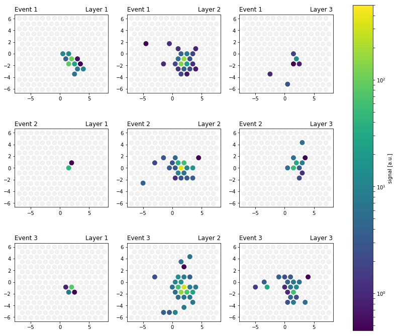

# GAN Tutorial
Train different types of Generative Adversarial Networks using [TensorFlow-GAN](https://github.com/tensorflow/tensorflow/tree/master/tensorflow/contrib/gan).
Provided types:
- Vanilla GAN *without* label switching
- Wasserstein GAN with gradient penalty (WGAN-GP)
- Spectral normalization GAN (SNGAN)
- WGAN-GP with spectral normalization

This repository cover the basic files of the **Advanced GAN Tutorial** given at the [IML Workshop 2019](https://indico.cern.ch/event/766872/contributions/3287965/) at CERN.

The full tutorial (including the gan_tutorial) can be found at **[IML 2019 tutorial](https://github.com/3pia/iml2019)**.

Which you can directly load on Binder: 

### Datasets
The repository provides GAN models for the following datasets:
- CIFAR10 / CIFAR100
- MNIST

Furthermore, you can use 2 **physics datasets**:
- **CMS prototype Calorimeter dataset**
     - Simulated using Geant4. For further details see [Comput Softw Big Sci (2018) 2: 4.](https://link.springer.com/article/10.1007%2Fs41781-018-0019-7).
In contrast to the publication, this datsets contains only data of 3 layers and a single energy bin (for simplicity reasons).
- **Footprints of cosmic ray induced air**
    - The  dataset contains footprints of cosmic ray induced air showers with energies between 1 - 100 EeV.
The details of the simulation can be found in [Astropart. Phys. 97 (2017) 46](https://www.sciencedirect.com/science/article/pii/S0927650517302219?via%3Dihub).

## Getting started
For starting the training just run one of the GAN scripts in the main folder.
For performance reason the usage of a GPU is highly recommended, otherwise the training lasts >10h, before producing reasonable results.
Runs produce TensorBoard outputs -> for monitoring training and plots after each "epoch".

# Resulting images

## WGAN-GP - CIFAR10 (CGAN / Conditioned)
Training duration~14 h NVIDIA 1080 GTX
##### Converging critic loss

##### Images

## Vanilla GAN - CIFAR10
Training duration~6 h NVIDIA 1080 GTX
##### Images - (mode collapse), changing to NS-GAN leads to better quality

## SN GAN - Air Shower
Training duration~6 h NVIDIA 1080 GTX

##### Discriminator loss

## WGAN SN - HG Calorimeter
Training duration ~7 h NVIDIA 1080 GTX

